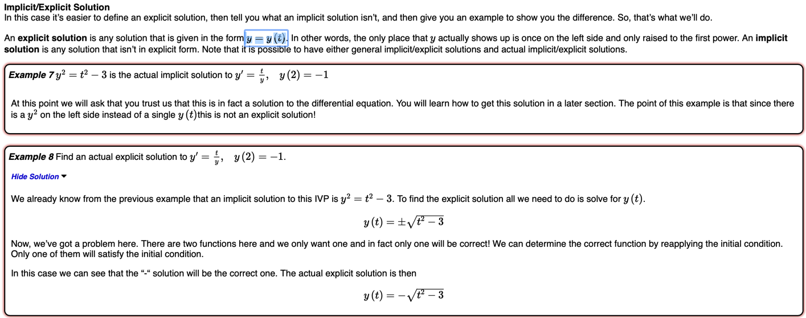
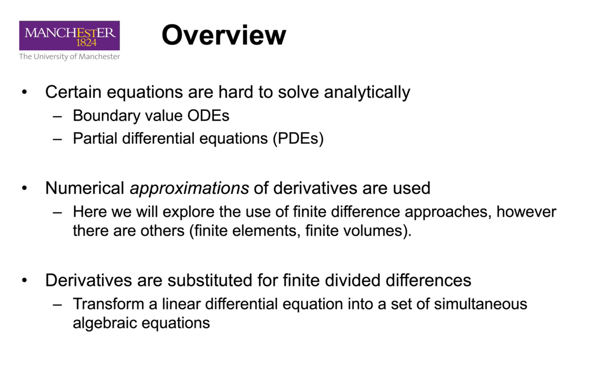
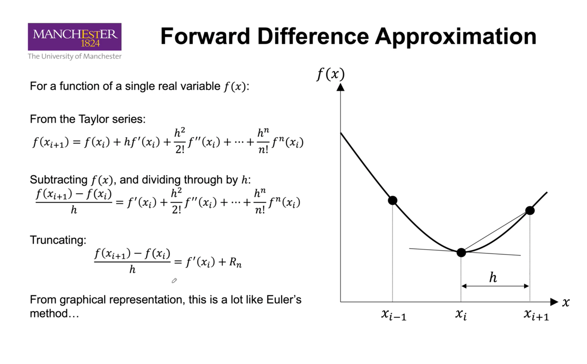
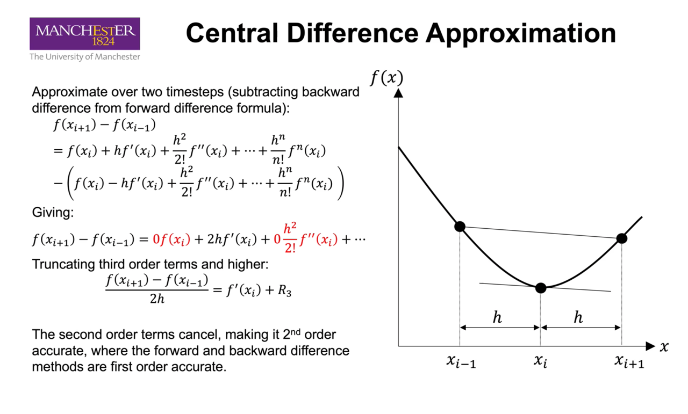
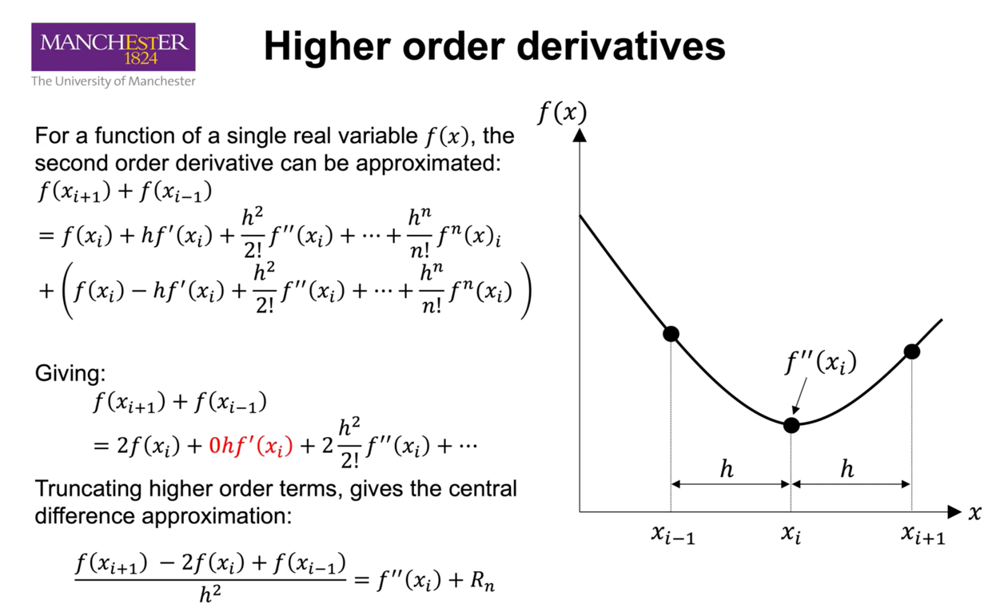

# Part 1: Explicit Solution of Heat Conductance Equation

> What does it mean by finding an explicit solution to a differential equation?

[Implicit / Explicit Solution](https://tutorial.math.lamar.edu/classes/de/definitions.aspx) |
--- |
 |

Here, `y**2 = t**2 - 3` is an implicit solution to the equation. This is not an explict solution
not because it is not in the form of `y = y(t)`; it does not explicitly define how `y` is determined from `t`.

Given the condition `y(2) = -1`, we can then find the explicit solution: `y = - sqrt(t**2 - 3)`.

> Advantage over implicit method?

...fill this in later?

> Disadvantage over implicit method?

"Explicit solution methods can encounter problems related to stability and accuracy.". This is because in 
most cases you can't find one analytically; you have to approximate one numerically, with methods such as
Finite Difference Methods.

> So how do I find an explicit solution to a pde?

1. Substitute Eqn.1 with finite difference approximations
2. Using the substituted equation, develop an "update scheme"
3. ... continue from here. 

> What's an "update scheme"?

Will come back to this later.

## Construct the finite difference equations

> Why are we doing this?

Finite Differences: Overview |
--- |
 |

Because analytical solutions to PDE's may be hard to find. We may want to

> How do we approximate a derivative with the Forward Difference method? 

Finite Differences: Forward Difference Approximation|
--- |
|

1. set a step size. (e.g. 20cm for the spatal dimension, 100s for the time  dimensionn)
1. approximate `f(x_{t+1})` with its taylor series.
2. subtract `f(x_{i})`, then divide them through by `h`.

> How do we approximate a derivative with the Central Difference method?

Finite Differences: Central Difference Approximation |
--- |
 |

1. find `f(x_{t-1})` and `f(x_{t+1})`
2. By `f(x_{t+1})` - `f(x_{t-1})`, you get an approximation of
the derivative, which is more accurate than Forward and Backward approximates.
   

> How do we approximate a second derivative with the Central M

Finite Differences: Higher Order Derivatives |
--- |
 |

1. find `f(x_{t-1})` and `f(x_{t+1})`
2. add them up, then you get an approximation of the second derivative.

> What's the justification for the Taylor's expansion? 

This might be slightly off-the-point. So let's not get into the details,
just for this report.

> What does it mean by "the update equations" here?

Does it mean Equ.1 substituted with the Difference Approximations?

## 1. Draw the computational molecule for a generic interior node

> What does it mean by "computational molecules"?

> How do we "draw" them?

## 2. Implement the finite difference solution scheme.

The program maybe need to ...

## 3. Create two plots. 

## 4. Adjust the solver.

1. to use delta_t = 50s, keeping delta_x = 20cm.
2. to use delta_t = 100s, but at delta_x = 10cm.
3. plot the results from each change.
4. analyse how the model responds to these changes. Discuss
this analysis in the report!
   