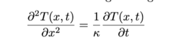
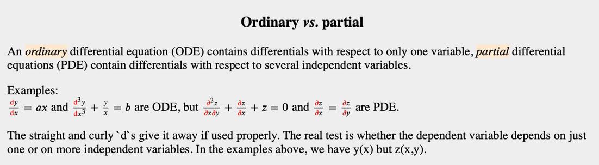

# Problem Definition

> What is the problem?

The problem is finding a solution to **Eqn. 1**:

That is, we want to find `T(x, t)` from the partial differential equation above.

> Why is the equation called "partial differential equation"?

[Classification of differential equations: ode vs. pde](https://users.aber.ac.uk/ruw/teach/260/classification.php)|
--- |
 |

It is called so, because the equation contains derivatives that are defined with respect to several
independent variables, namely `t` and  `x`.  

> Why are we doing this? Why do we want to find `T(x, t)`?

Because the manufacturing team needs to know the temperature distribution
along the length of the bar (`x`) after a period of 10 minutes (`t`).

Remember, this course is about modeling real-world phenomenon with maths (i.e. mathematical modeling). We are exploring
one good example of that here!

> So how do we find `T(x, t)` then?

By taking a numerical approach, based on **finite difference approximations of derivatives**.
- in part 1, we find an explicit solution to this
  - with 
- in part 2, we find an implicit solution to this.
  - with a method called "Crank-Nicholson method".

> Why are we using finite difference approximations of derivatives to solve the equation?

Because it allows us to convert ODE's or PDE's, which may contain non-linear equations, into a "system of linear equations", which we can then
solve by matrix algebra techniques ([wiki](https://en.wikipedia.org/wiki/Finite_difference_method)).

> Why is it suggested that we think of the problem on a two-dimensional grid?

(Probably) Because we are using a Finite Difference Method. In order to use this method,
we must define "steps". (" finite difference" = `f(x + b) - f(x + a)`). 

